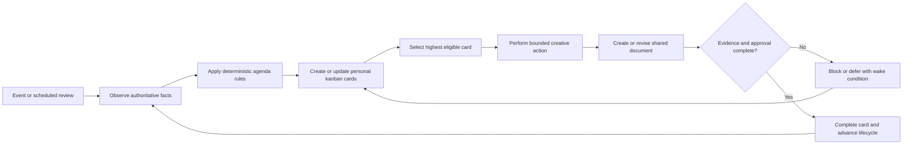
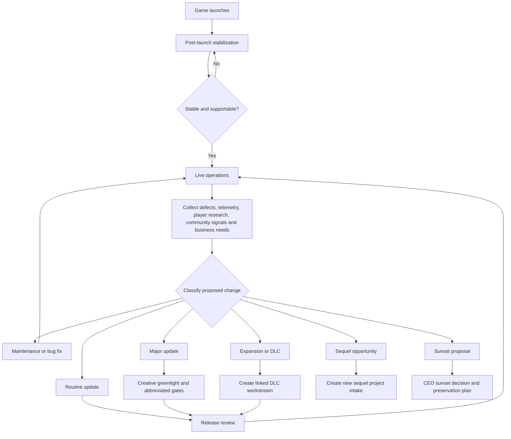
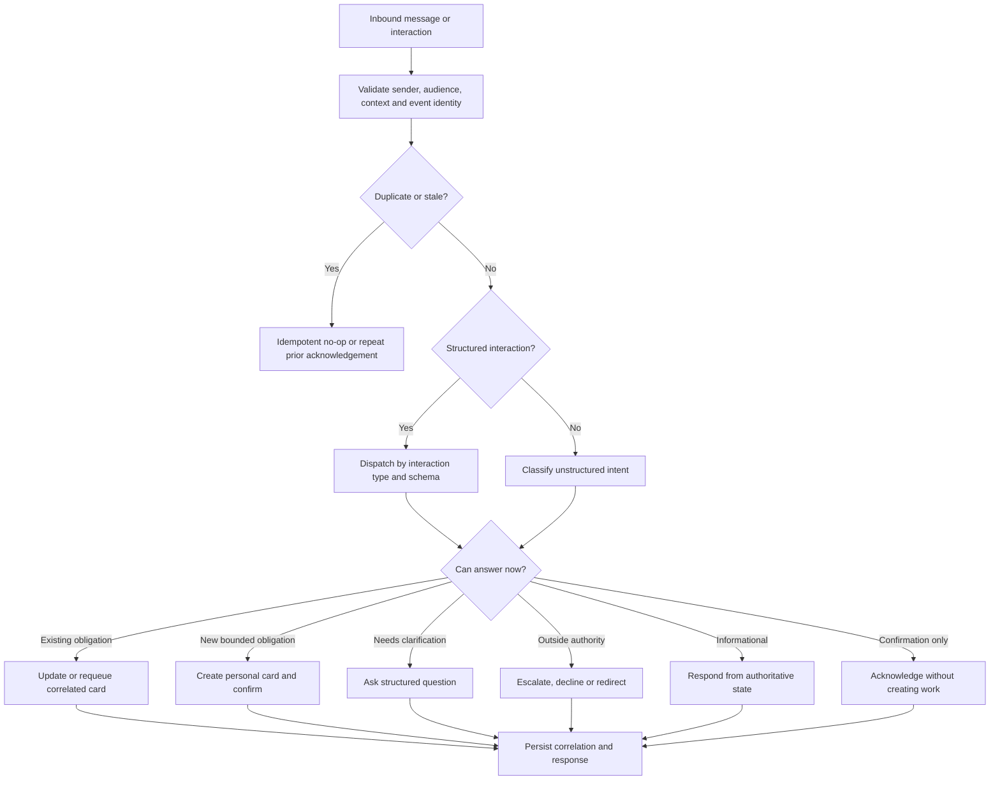

# Deterministic Creative Director Operating Model

**Status:** Version 1.2.0 implementation baseline and forward design  
**Scope:** `CSweet.Agent.CreativeDirector.VideoGame`  
**Purpose:** Define an inspectable, partially deterministic operating model for a video game Creative Director agent from initial hire through concurrent project supervision, launch, live operations, expansions, sequels, and closure.

## 1. Intent

The Creative Director should retain the benefits of AI—creative synthesis, critique, option generation, and adaptation—without allowing the model to invent an opaque or inconsistent agenda.

The intended division of responsibility is:

- Deterministic policy decides what requires attention, which action is eligible, its priority, its authority boundary, its required evidence, and its completion condition.
- The personal kanban board is the Creative Director's executable agenda.
- Project boards are the inspectable source of truth for delegated production work.
- Collaborative documents are the shared thinking, revision, and decision surface between the CEO and Creative Director.
- The language model performs bounded creative work inside the selected agenda item.
- Exact document revisions, decisions, evidence, and lifecycle state determine whether work may advance.

The goal is not deterministic creative output. The goal is deterministic intent, governance, prioritization, and follow-through around creative output.

## 2. Current-state assessment

Version 1.2.0 establishes the first executable slice of this model. The agent now has:

- An explicit Creative Director lifecycle.
- Exact artifact revisions and hashes.
- Governed approval flows and idempotent external actions.
- Separate operating-state keys for concurrent projects.
- A portfolio index and periodic reconciliation.
- A typed inbound-message classifier that distinguishes workflow input, acknowledgement, status,
  immediate information, and durable action.
- One correlated personal card for each chat-created creative obligation.
- One stable recurring portfolio-review card per project, reconciled every four hours during active
  development and daily during oversight, including launch and post-production responsibility.
- Personal-card claim, completion, deferral, blocking, release, and requeue support through the SDK.
- A personal-work availability subscription, plus five-minute attention review as a recovery and
  fairness safety net.
- A versioned high-level game design document.
- Structured document review findings.
- An accepted-vision handoff to the accountable Producer.
- A production profile spanning concept through live operations and closure.

The remaining design and implementation gaps are:

- The project board is seeded with only a small initial set of production epics.
- Creative Director operating state ends in a broad `Oversight` phase even though the product lifecycle continues through production, launch, stabilization, live operations, and closure.
- Production and post-production signals still need a complete typed mapping into bounded specialist
  review, milestone, live-health, expansion, sunset, and sequel-intake cards.
- Multi-project reconciliation exists, but an explicit cross-project attention budget and portfolio
  priority score remain future work.
- Structured agent-addressed widget interactions still require platform-level typed
  `CreateInteraction`/`RespondToInteraction` contracts; current agents should use direct messages,
  coordination, or governed decisions instead of automating human UI widgets.

The working assessment is:

| Dimension | Approximate maturity |
| --- | ---: |
| Lifecycle and governance determinism | 7/10 |
| Creative-output reproducibility | 3/10 |
| Ongoing agenda determinism | 2–3/10 |
| Multi-project state isolation | 7/10 |
| Multi-project prioritization | 3/10 |

These numbers are directional rather than formal evaluation scores.

## 3. Core operating loop



Every selected action should be explainable with the following facts:

- Why is this action due now?
- Which project, product, franchise, or portfolio decision does it affect?
- Which event, schedule, or dependency created it?
- Who owns the decision?
- Which authority envelope applies?
- Which document or evidence is required?
- What constitutes completion?
- What is the next wake condition if progress is not currently possible?

## 4. End-to-end Creative Director lifecycle

### 4.1 Initial hire and operating setup

1. Confirm the authoritative manager and Creative Director authority.
2. Establish the CEO's desired involvement mode.
3. Create or update the CEO–Creative Director operating agreement.
4. Establish portfolio capacity and review cadence.
5. Create recurring personal agenda items for portfolio review.
6. Record explicit business, creative, approval, and communication constraints.
7. Await a project mandate or originate bounded opportunity exploration when authorized.

### 4.2 Project intake

1. Capture the business mandate and intended player outcome.
2. Gather supplied references and existing franchise constraints.
3. Record platform, audience, genre, scope, budget, schedule, accessibility, localization, monetization, and technology assumptions.
4. Separate non-negotiable constraints from preferences and open questions.
5. Create the project exploration notebook and intake agenda card.
6. Decide whether to explore, defer, reject, or proceed to concepts.

### 4.3 Concept exploration

1. Generate a bounded set of materially different concepts.
2. Compare each concept against the mandate, portfolio strategy, feasibility assumptions, and player promise.
3. Preserve useful constraints without repeatedly recycling rejected premises.
4. Recommend pursue, refine, park, or reject.
5. Iterate with the CEO according to the chosen involvement mode.

### 4.4 Vision approval

1. Produce an exact, revisioned high-level game vision.
2. Make the player promise, core loop, creative pillars, audience, scope, tone, non-goals, risks, assumptions, and success criteria explicit.
3. Submit the exact revision for structured approval.
4. Accept only the exact authorized revision and digest.
5. Complete the vision agenda card.
6. Begin governed staffing and workstream formation.

### 4.5 Team and project formation

1. Propose the appropriate accountable team and Producer.
2. Create the governed workstream and project board.
3. Establish milestones, evidence requirements, authority boundaries, and human gates.
4. Hand the exact accepted vision to the Producer.
5. Require exact-digest acknowledgement before detailed planning begins.
6. Create initial board items and Creative Director review obligations.

### 4.6 Pre-production

1. Review the detailed game design, technical direction, production plan, art direction, narrative direction, audio direction, UX/accessibility direction, and evaluation strategy.
2. Identify contradictions across documents and disciplines.
3. Record findings against exact document revisions.
4. Require correction of blocking findings.
5. Approve the package only when the required evidence is complete and coherent.

### 4.7 Prototype

1. Review reproducible playable evidence rather than descriptions alone.
2. Evaluate whether the prototype tests the central player promise and riskiest assumptions.
3. Incorporate structured playtest findings.
4. Decide iterate, pivot, stop, or proceed.
5. Record the exact evidence and rationale.

### 4.8 Vertical slice

1. Judge whether the slice represents the intended complete experience rather than an isolated prototype.
2. Establish the production quality bar for visuals, interaction, narrative, audio, performance, and accessibility.
3. Validate pipeline and staffing readiness with accountable specialists.
4. Approve production, request changes, or return to an earlier phase.

### 4.9 Production

1. Protect the accepted player promise and creative pillars.
2. Review scheduled integrated builds and milestone evidence.
3. Resolve material creative conflicts and drift.
4. Avoid taking over routine Producer or specialist responsibilities.
5. Use change control for material alterations to scope, pillars, audience, or experience.

### 4.10 Alpha and beta

1. Review coherence, pacing, completeness, usability, accessibility, and player response.
2. Prioritize experiential defects separately from ordinary implementation defects.
3. Review cuts and compromises against the accepted non-goals and creative pillars.
4. Require new evidence when a material revision invalidates prior acceptance.

### 4.11 Release candidate and launch

1. Review final creative readiness and release evidence.
2. Recommend launch, hold, or bounded remediation.
3. Preserve explicit human authority for public launch.
4. Establish the live-game creative charter before transitioning to post-production.

## 5. Post-production and live-game lifecycle

Launch is a major lifecycle transition, not the end of Creative Direction.



### 5.1 Post-launch stabilization

The immediate goal is to make the released experience stable, supportable, and faithful to the launch promise.

Creative Director responsibilities include:

- Review launch defects that materially affect the player experience.
- Distinguish technical breakage from experience or content design problems.
- Protect intended difficulty, pacing, progression, presentation, narrative continuity, and accessibility while urgent fixes are made.
- Review evidence for consequential changes made under launch pressure.
- Decide when the game is ready to leave stabilization and enter normal live operations.

### 5.2 Live operations

Live operations is a recurring evidence and release cycle:

1. Observe product health, defects, player research, community signals, commercial context, and team capacity.
2. Classify proposed changes.
3. Create only the necessary Creative Director agenda items.
4. Require a release brief for material changes.
5. Review exact builds and player evidence when creative intent may be affected.
6. Record accepted changes in the live-game charter and creative decision log.
7. Reassess continuation, expansion, sequel, or sunset at defined intervals.

### 5.3 Deterministic change classification

| Change class | Examples | Creative Director action |
| --- | --- | --- |
| Maintenance | Crashes, exploits, compatibility, broken quests | Intervene only when a fix changes player experience or creative intent |
| Routine update | Balance tuning, events, cosmetics, small quality improvements | Review a bounded release brief against the live-game charter |
| Major update | Progression overhaul, major system, substantial new mode | Require creative greenlight and abbreviated lifecycle gates |
| Expansion or DLC | New campaign, region, major mechanic, substantial story arc | Create a linked workstream with its own vision, board, documents, budget, and milestones |
| Sequel | New product promise, technology generation, audience, or market position | Start a new project intake while retaining franchise lineage |
| Sunset | End of development, maintenance, or service | Recommend timing and player treatment; require appropriate executive approval |

Classification questions should include:

- Does this change the player promise?
- Does this alter a creative pillar?
- Does this materially change canon, tone, progression, monetization, or audience?
- Does it require new specialist staffing?
- Does it introduce a material budget or schedule commitment?
- Does it require separate marketing, certification, localization, or launch planning?
- Can it be safely reverted within the normal release train?
- Does it invalidate accepted evidence from a previous gate?

Crossing defined thresholds should promote a proposal from routine update to major update, expansion/DLC, or new project.

### 5.4 Expansions and DLC

An expansion or substantial DLC should be a linked project or workstream rather than an unstructured extension of the base game's board.

It may inherit references to:

- The live-game creative charter.
- Accepted franchise canon.
- Technical and accessibility constraints.
- Existing audience and player-research evidence.
- Proven production pipelines.

It should still maintain independent:

- Vision and scope.
- Board and milestones.
- Budget and schedule.
- Staffing and accountable Producer.
- Documents and exact approval evidence.
- Release-readiness decision.

### 5.5 Sequels

A sequel is always a new project. It may reference the prior game's history but must not inherit an accepted vision as though it remains automatically authoritative.

The sequel begins with:

1. A franchise opportunity assessment.
2. Evidence from the released game's reception and long-term performance.
3. Explicit articulation of what should be preserved, evolved, or rejected.
4. A new business mandate and player promise.
5. A new exploration notebook, vision, workstream, board, staffing decision, and approval chain.

### 5.6 Sunset and closure

Sunset requires intentional creative and player treatment, particularly for a live service.

The closure path should cover:

- Reason and authority for closure.
- Communication and player-transition plan.
- Preservation of builds, source, assets, documents, and decision history.
- Treatment of paid content, online dependencies, and community-created material.
- Franchise continuity and canon implications.
- Team transition.
- Final retrospective and reusable lessons.

## 6. Kanban operating model

### 6.1 Personal Creative Director board

The personal board represents work the Creative Director personally owes. It should not mirror the entire project board.

Typical personal cards include:

- Review CEO mandate.
- Produce concept alternatives.
- Revise the game vision.
- Review a submitted milestone package.
- Resolve a creative escalation.
- Review an integrated build.
- Prepare the weekly portfolio review.
- Evaluate an expansion proposal.
- Prepare a sequel opportunity assessment.
- Review a sunset proposal.

Each personal card should contain:

- Project, product, or franchise identifier.
- Lifecycle phase.
- Agenda card type.
- Trigger and source event.
- Priority class and rationale.
- Linked project-board item when applicable.
- Linked document and exact revision when applicable.
- Required evidence.
- Decision owner and required reviewers.
- Definition of done.
- Due date or review cadence.
- Wake condition and waiting party when deferred.
- Idempotency or correlation identity.

Recommended discipline:

- One substantial creative task running at a time.
- Urgent executive decisions and production blockers may preempt routine work.
- Waiting tasks are explicitly deferred with a wake time or external dependency.
- Completed tasks record a concise outcome and exact evidence.
- Repeated scheduled work creates or requeues a stable card type rather than producing unbounded duplicates.

### 6.2 Project production boards

Project boards represent delegated delivery work and remain operationally led by the Producer.

They contain:

- Milestones and gates.
- Features and content.
- Specialist assignments.
- Bugs and research spikes.
- Build, validation, evaluation, and release work.
- Creative-review requests.
- Evidence links and exact artifact revisions.

A linked personal card should be created only when Creative Director judgment or action is required.

### 6.3 Agenda rule examples

| Trigger | Personal agenda action | Completion evidence |
| --- | --- | --- |
| Agent hired | Establish operating agreement and portfolio cadence | Accepted operating agreement and scheduled review cards |
| New project request | Perform project intake | Completed intake record and pursue/defer/reject decision |
| Concept exploration authorized | Produce bounded alternatives | Revisioned exploration notebook and recommendation |
| Vision revision submitted | Review or route exact revision | Structured decision against exact digest |
| Staffing or workstream approved | Verify project foundation and handoff | Board, accountable Producer, and exact-digest acknowledgement |
| Milestone evidence submitted | Perform rubric-bound review | Findings and decision tied to exact evidence |
| Blocking creative question | Preempt lower-priority exploration | Decision relayed to original requester |
| Material vision drift detected | Perform change-control review | Approved revision or recorded rejection |
| Project review date reached | Perform health check | Updated state, risk assessment, and next review date |
| Launch approaches | Prepare creative-readiness recommendation | Exact release evidence and recommendation |
| Material live-game change proposed | Classify change and select governance path | Recorded classification and linked workstream/release action |
| Expansion proposed | Perform expansion greenlight review | Approved, deferred, or rejected greenlight memo |
| Sequel signal detected | Perform franchise opportunity assessment | CEO decision to explore, defer, or reject |
| Project closes | Complete retrospective and archive | Accepted retrospective and preserved evidence index |

## 7. CEO–Creative Director document collaboration

### 7.1 Creative Mandate and Decision Notebook

Each project should have one living collaboration document distinct from the formal game design document.

Recommended sections:

1. CEO mandate and business intent.
2. Player promise.
3. Non-negotiable constraints.
4. Preferences and hypotheses.
5. Open creative questions.
6. Options under consideration.
7. Creative Director recommendation.
8. CEO decisions.
9. Deferred ideas.
10. Superseded decisions.
11. Links to formal approved artifacts.

The collaboration pattern is:

```text
Explore in notebook
  → Frame two to four concrete alternatives
  → Record the Creative Director recommendation
  → CEO comments or decides
  → Creative Director creates an exact revision
  → Required authority accepts the exact revision
  → Propagate the decision into formal artifacts and board cards
```

Exploration remains non-authoritative until an exact revision is accepted. Conversational fragments must not silently become project authority.

### 7.2 Durable document set

The desired document set includes:

- CEO–Creative Director operating agreement.
- Project Creative Mandate and Decision Notebook.
- Accepted high-level game vision.
- Detailed game design package.
- Creative quality bar and vertical-slice rubric.
- Creative decision log.
- Milestone review packets.
- Live Game Creative Charter.
- Release briefs for material updates.
- Expansion/DLC greenlight memos.
- Franchise opportunity assessments.
- Sequel exploration notebooks.
- Sunset and player-transition plan.
- Project retrospective.

Documents should be linked rather than copied. Later projects may cite exact accepted revisions from earlier projects, but inherited decisions should be explicit.

## 8. Multi-project and franchise supervision

### 8.1 Portfolio modes

Every supervised item should have an explicit attention mode:

- **Incubating:** bounded concept work with low routine attention.
- **Active production:** scheduled creative reviews and immediate blocker handling.
- **Stabilizing:** high-frequency review of launch-critical experiential issues.
- **Live operations:** release-based and periodic review.
- **Paused:** no routine work until a recorded wake condition.
- **Closed:** archived except for explicitly authorized revival or franchise reference.

### 8.2 Deterministic portfolio priority

Recommended priority order:

1. CEO decision request.
2. Production or live-service blocker affecting players.
3. Launch, certification, or lifecycle gate deadline.
4. Material creative drift, legal/trust concern, or franchise risk.
5. Scheduled active-project or release review.
6. Live-game health review.
7. Incubation and speculative exploration.

Additional ordering factors may include due date, severity, age, blocked dependents, budget exposure, release proximity, and explicit executive priority.

### 8.3 Capacity policy

A single Creative Director identity should maintain portfolio continuity and taste. Project state, boards, evidence, and decisions remain isolated.

When active-project demand exceeds the configured attention budget, the deterministic response should be one or more of:

- Defer a new greenlight.
- Reduce an agreed review cadence.
- Pause incubation.
- Propose a project Creative Lead or subordinate Creative Director.
- Escalate an explicit portfolio tradeoff to the CEO.

The agent should not silently provide shallower supervision.

### 8.4 Product and franchise hierarchy

```text
Franchise / IP
├── Released base game
│   ├── Maintenance and live-operation release trains
│   ├── Expansion A project
│   └── DLC B project
└── Sequel project
```

The base game remains a supervised portfolio item while it is maintained. Expansions and DLC are linked projects. Sequels are new projects. Franchise-level documents provide lineage without collapsing their state or approvals together.

## 9. Suggested recurring cadence

Cadence should be configurable by portfolio mode and project risk.

| Context | Suggested cadence |
| --- | --- |
| Initial stabilization | Daily review of critical experiential defects |
| Active production | Milestone-based plus scheduled integrated-build reviews |
| Live operations | Weekly change/release scan |
| Material release | Exact build, evidence, and release-brief review |
| Portfolio | Weekly priority and capacity review |
| Franchise | Quarterly roadmap and opportunity review with CEO |
| Long-term continuation | Annual or material-change continuation/expansion/sequel/sunset assessment |

An event should supersede the cadence when it creates a higher-priority obligation.

## 10. Authority boundaries

The deterministic agenda must preserve role boundaries:

- The CEO owns consequential company, portfolio, funding, launch, and sunset decisions unless explicitly delegated.
- The Creative Director owns the player promise, creative pillars, coherence, taste, and consequential creative approval within the granted envelope.
- The Producer owns operational planning, sequencing, team coordination, schedule, dependencies, and routine delivery management.
- Specialist leads own their discipline decisions and evidence.
- The Creative Director may identify conflicts and request decisions without absorbing another role's accountability.
- Public launch, publication, spending, staffing, legal commitments, and destructive sunset actions remain governed by their platform authority.

## 11. Determinism boundaries

The following should be deterministic or strongly constrained:

- Lifecycle transitions.
- Agenda card creation and deduplication.
- Priority calculation.
- Eligibility and WIP rules.
- Authority routing.
- Required evidence and reviewers.
- Exact revision and digest binding.
- Completion, blocking, deferral, and wake behavior.
- Portfolio isolation.
- Notification suppression and idempotency.

The following may remain generative:

- Concept generation.
- Creative comparison and critique.
- Drafting and revising documents.
- Interpreting qualitative player feedback.
- Identifying possible creative risks.
- Producing a recommendation within a bounded decision frame.

Generative output must not independently advance lifecycle state or broaden authority.

## 12. Success criteria

The operating model is successful when:

- The Creative Director can always explain why it selected its current action.
- Every meaningful obligation is visible on a board or represented by a recorded scheduled review.
- Waiting work has an explicit wake condition.
- The CEO can inspect and alter priorities without rewriting prompts.
- Creative exploration remains flexible while authoritative decisions remain exact and auditable.
- Multiple projects cannot overwrite or leak state into one another.
- Live games continue receiving deliberate creative supervision after launch.
- Maintenance, updates, expansions, sequels, and sunset follow distinct governance paths.
- The agent does not create duplicate work from repeated events.
- No project silently loses attention when portfolio capacity is exceeded.

## 13. Open design questions

The following questions should be resolved before implementation planning:

1. What is the default Creative Director WIP limit across projects?
2. How many active productions and live games may one installation supervise before requiring an explicit capacity decision?
3. Should the personal board contain recurring cards, or should stable cards be requeued by scheduled events?
4. Which priority factors are fixed policy and which are configurable by the CEO?
5. What exact thresholds distinguish routine update, major update, expansion/DLC, and sequel?
6. Which project lifecycle transitions may move backward, and what evidence is invalidated when they do?
7. Should the live-game creative charter be a standalone artifact type or a revision of the accepted vision package?
8. How should inline CEO document feedback map to exact revisions and structured decisions?
9. When should an expansion use a child workstream versus a fully independent project?
10. What portfolio-level document should summarize franchise lineage, accepted canon, reusable assets, and superseded decisions?
11. What conditions automatically create continuation, sequel, or sunset review cards?
12. Which post-launch decisions require CEO approval even when the Creative Director is operating in delegated mode?

## 14. Recommended next specification

The next design artifact should be a complete catalog of Creative Director agenda card types. Each card type should define:

- Stable type key.
- Triggering events and scheduled triggers.
- Applicable lifecycle phases and portfolio modes.
- Priority calculation.
- Eligibility and WIP behavior.
- Required inputs and linked documents.
- Bounded model task.
- Required authority and reviewers.
- Completion evidence.
- Block and defer behavior.
- Wake conditions.
- Resulting lifecycle transition or follow-up card.
- Idempotency and correlation rules.

That catalog can become the behavioral contract for later implementation and evaluation without prescribing creative output.

## 15. Runtime continuation and durable work

### 15.1 Fundamental model

The agent should not keep itself alive with an in-memory loop, long-running model turn, or sleeping process. C-Sweet should preserve obligations durably and wake the installation when work may be actionable.

The runtime process, the scheduled wake mechanism, and the durable obligation are separate concepts:

- The runtime may start, stop, reconnect, or recover.
- An event or scheduled review creates a bounded execution opportunity.
- The obligation remains in operating state, a personal card, a project card, a coordination session, a decision, or an artifact workflow.
- No required future action may exist only in model context or an in-memory continuation.

The governing principle is:

> The runtime may sleep, but the obligation must remain durable, correlated, inspectable, and wakeable.

### 15.2 Existing platform wake mechanisms

The implementation can build on three existing mechanisms.

#### Periodic attention reviews

The Creative Director manifest declares:

- `AlwaysOn` activation.
- A default attention interval of 300 seconds.
- Subscription to `com.csweet.agent.attention.review-due.v1`.

The platform attention scheduler checks schedules every 15 seconds. A review is produced when:

- The installation first starts.
- The runtime reconnects after its previous review.
- The periodic review time arrives.
- Platform state explicitly invalidates the current attention schedule.

The scheduler creates a deterministic review event and advances the next-review time from the current time. Missed intervals do not accumulate while an Office is offline.

The Creative Director currently responds by reconciling the portfolio. This makes attention review a useful recovery, fairness, and consistency mechanism, but it should not be the primary latency path for known dependencies.

#### Durable platform events

Relevant platform events are written to a durable outbox and routed to subscribed installations. The dispatcher persists delivery into the agent work inbox before trying to start or wake the runtime. Temporary runtime-start failure therefore does not erase the event.

Events should provide the normal low-latency continuation path for:

- Manager messages and structured input.
- Exact document submissions and decisions.
- Staffing and workforce changes.
- Workstream and authority changes.
- Work-item and sprint changes.
- Coordination responses.
- Decisions and escalations.
- Build, validation, media, preview, evaluation, and release-readiness results.

The receiving handler should correlate an event to an existing agenda card or create a deterministic new card. It should not repeat the entire originating action merely because the event was delivered more than once.

#### Personal-task availability

When an agent-owned personal card becomes Ready, C-Sweet can emit a durable `com.csweet.work.personal-todo.available.v1` event. The SDK then:

1. Atomically claims the highest-ranked Ready card.
2. Moves it into Running.
3. Calls `HandlePersonalTodoAsync`.
4. Applies the returned disposition.
5. Repeats for up to three cards during the wake.

The per-installation claim gate, item revision, event identity, and claim expiration prevent concurrent or abandoned execution from silently completing the same card twice.

The current Creative Director does not implement `HandlePersonalTodoAsync`. The SDK default blocks claimed work as unsupported. The current manifest also requests only `work.personal-todo.add.v1`; implementation of this specification will require review of the complete personal-task capability and event subscription envelope.

### 15.3 Personal-task dispositions

Each bounded personal-work callback must end with an explicit disposition.

| Disposition | Durable meaning | Appropriate use |
| --- | --- | --- |
| `Completed` | Move the card to Completed and record its result | The card's definition of done and evidence are satisfied |
| `WaitingUntil` | Keep the card visibly Running, release its claim, and record a future review time, reason, and optional waiting party | Time-based follow-up or a dependency that also needs a safety-net review |
| `InProgress` | Keep the card visibly Running and release its transient claim without scheduling a time | An external event is guaranteed to requeue the exact card |
| `Blocked` | Move the card to Blocked and record the blocking reason | Work cannot resume without explicit intervention or policy change |

`InProgress` must not be used to mean “please call me again.” It has no inherent time-based wake. The implementation must already have a correlated external event path that requeues the card. Otherwise it should use `WaitingUntil` or create an immediately Ready successor card.

The platform constrains a deferred review to the next 30 days. A personal-work reconciliation worker runs every 30 seconds and:

- Requeues due deferred cards.
- Recovers expired claims.
- Re-emits missing availability wakes for stranded Ready cards.
- Coalesces duplicate active availability deliveries.

### 15.4 Run-to-quiescence algorithm

Every wake should move the portfolio toward a state in which nothing is immediately actionable.

```text
on wake(trigger):
    checkpoint trigger identity
    observe authorized portfolio, project and dependency facts
    reconcile deterministic agenda cards

    repeat within execution budget:
        select highest-priority eligible personal card
        if none exists:
            stop: quiescent

        atomically claim card
        validate card revision, authority and exact inputs
        perform one bounded action
        persist every external result with stable idempotency keys
        checkpoint state and evidence

        if definition of done is satisfied:
            complete card
            expose deterministic successor cards
        else if waiting for a known event:
            persist dependency correlation
            keep InProgress only when that event will requeue the card
        else if waiting for time or follow-up:
            defer with WaitingUntil
        else if intervention is required:
            block with reason and notify the correct authority
        else:
            create or requeue the next bounded step

    if execution budget is exhausted:
        leave remaining eligible work Ready for another durable wake
```

“Execution budget” should include at least:

- Maximum cards handled per wake.
- Maximum wall-clock duration.
- Maximum model calls.
- Maximum external mutations.
- Cancellation and lease deadlines.

The existing SDK limit of three personal cards per wake is a suitable initial safety bound. A card itself should also represent a bounded unit of work rather than an entire project phase.

### 15.5 Dependency correlation

Every waiting card should declare what will make it actionable again.

Recommended dependency fields include:

- Stable agenda card type key.
- Project or franchise identifier.
- Workstream, board, and work-item identifiers.
- Source event and causation identifiers.
- Expected event type or scheduled wake category.
- Expected aggregate identifier, such as decision, artifact, package, build, evaluation, staffing request, or coordination session.
- Exact expected revision, digest, or version where relevant.
- Waiting-on organization user where relevant.
- Earliest or next review time.
- Timeout or escalation policy.

Examples:

| Waiting condition | Correlation | Wake behavior |
| --- | --- | --- |
| CEO reviewing a vision revision | Artifact ID, revision ID, digest, CEO ID | Exact decision event requeues immediately; scheduled review provides follow-up |
| Staffing request pending | Resource-change request ID | Decided or workforce-changed event requeues |
| Build pending | Build request ID and source revision | Build-published or failed event requeues |
| Playtest pending | Evaluation session ID | Evaluation-completed event requeues |
| Specialist response pending | Coordination session ID and expected turn | Coordination turn event resumes the obligation |
| Scheduled portfolio review | Portfolio review card type and next review time | Deferred-card reconciliation requeues |

An event that does not match the stored correlation should not complete or advance the waiting card.

### 15.6 Event handler responsibilities

Event handlers should be thin and deterministic:

1. Validate event identity and authorized context.
2. Record or merge the new authoritative fact.
3. Find affected agenda cards by stable correlation.
4. Requeue or create the appropriate cards idempotently.
5. Invoke bounded reconciliation when safe.
6. Return without maintaining an in-memory wait.

The same event may wake both a specific card and the portfolio reconciler. Repeated delivery should produce the same resulting state and no duplicate card, document, decision, or notification.

### 15.7 Failure and recovery behavior

Implementors should assume at-least-once delivery, process termination between any two awaits, stale reads, revision conflicts, and partially successful external workflows.

Required safeguards include:

- Stable domain idempotency keys for every external mutation.
- Optimistic state revisions with deterministic merge behavior.
- Exact artifact revision and digest binding.
- Claim expiration and recovery.
- Durable causation and correlation identifiers.
- Reconciliation that discovers already-created resources after a lost response.
- No phase advance based solely on a model statement or chat acknowledgement.
- Cancellation checks before expensive or mutating steps.
- Notification fingerprints to prevent unchanged-state chatter.

If a model or platform dependency temporarily fails, the card should retain the accepted inputs and return to a retryable waiting or Ready state according to a bounded retry policy. It should not ask the manager to re-enter already persisted direction.

### 15.8 Recommended capability review

The implementation should evaluate whether the Creative Director requires the following personal-work capabilities in addition to its current add authority:

- `work.personal-todo.read.v1`
- `work.personal-todo.claim.v1`
- `work.personal-todo.complete.v1`
- `work.personal-todo.block.v1`
- `work.personal-todo.release.v1`
- `work.personal-todo.defer.v1`
- `work.personal-todo.update.v1`
- `work.personal-todo.requeue.v1`
- `work.personal-todo.activate.v1`
- `work.personal-todo.reorder.v1`, only if the agent itself may change priority ordering
- `work.personal-todo.archive.v1` and `restore.v1`, only if lifecycle policy requires agent-owned archival

The manifest should subscribe to `com.csweet.work.personal-todo.available.v1` if the agent is expected to execute its personal board. Every requested capability must have a narrow documented purpose, implementation, and test. Capability declarations do not themselves grant authority.

### 15.9 Recommended initial continuation policy

An initial implementation can use these rules:

- Event-driven wake is preferred for known external dependencies.
- Five-minute attention review is the recovery and fairness safety net.
- Scheduled personal-card wake is used for cadence, follow-up, and bounded retry.
- At most three cards are handled during one wake.
- At most one substantial generative card is Running across the Creative Director portfolio unless an urgent interruption is explicitly selected.
- Immediately available successor work becomes Ready rather than remaining ambiguously InProgress.
- A waiting card must always name its dependency or next review time.
- A blocked card must identify the authority or state change required to unblock it.
- Portfolio reconciliation must not create duplicate cards for unchanged facts.

### 15.10 Implementation test scenarios

The implementation should include end-to-end and focused tests for at least the following scenarios:

1. A Ready personal card wakes the installation and is claimed exactly once.
2. One wake drains no more than the configured work budget.
3. Completing a card creates its deterministic successor without duplication.
4. A manager-review card records the exact artifact revision and waiting manager.
5. The exact manager decision immediately requeues the waiting card.
6. An unrelated artifact decision does not requeue or complete the card.
7. A deferred card wakes at its review time after a runtime restart.
8. An expired claim returns to Ready and is safely retried.
9. Duplicate availability and platform events do not duplicate work or mutations.
10. A lost mutation response is recovered by reconciliation using the stable idempotency key.
11. A model timeout preserves inputs and creates a bounded retry path.
12. A denied capability blocks or defers the card with actionable evidence rather than looping.
13. Multiple projects maintain isolated cards and correlations.
14. Portfolio priority selects an urgent production blocker before speculative concept work.
15. Exhausting the execution budget leaves remaining work Ready.
16. An Office or agent runtime restart produces recovery review without replaying completed work.
17. A card cannot advance lifecycle state without the required exact evidence and authority.
18. Post-launch change classification creates the correct maintenance, update, DLC, sequel, or sunset path.

### 15.11 Implementation sequence

A low-risk implementation order is:

1. Define the agenda card catalog and stable correlation schema.
2. Add manifest capabilities and availability subscription with conformance tests.
3. Implement personal-card dispatch and dispositions without model calls.
4. Translate the current vision task into the first executable agenda card.
5. Add event-to-card requeue correlation for manager document decisions.
6. Add attention-review reconciliation and duplicate suppression.
7. Add deterministic priority and WIP enforcement.
8. Migrate remaining pre-production and production obligations into card types.
9. Add post-production and live-operations card types.
10. Add recovery, concurrency, and multi-project evaluation programs.

This sequence proves the continuation substrate before moving substantial creative behavior onto it.

### 15.12 Existing implementation anchors

Implementors should verify behavior against the current source rather than relying only on this design document:

- `csweet-plugin.json` — activation mode, attention interval, capability requests, and event subscriptions.
- `src/CSweet.Agent.CreativeDirector.VideoGame/VideoGameCreativeDirectorAgent.cs` — attention reconciliation, event handling, portfolio state, the existing vision personal card, and external mutation idempotency.
- `src/CSweet.Agent.CreativeDirector.VideoGame/CreativeDirectorModels.cs` — current project lifecycle and portfolio state schema.
- `tests/CSweet.Agent.CreativeDirector.VideoGame.Tests/CreativeDirectorLifecycleTests.cs` — deterministic transition, isolation, digest, review, and lifecycle expectations.
- `../CSweetAgentSdk/src/CSweet.Agent.SDK/CSweetAgentBase.cs` — personal-work and attention callback contracts.
- `../CSweetAgentSdk/src/CSweet.Agent.SDK/AgentRuntimeWorker.cs` — event dispatch, atomic personal-card draining, disposition handling, and per-wake card limit.
- `../CSweetAgentSdk/src/CSweet.Agent.SDK/PersonalTodoResult.cs` — exact Completed, InProgress, WaitingUntil, and Blocked semantics.
- `../csweet/src/CSweet.AgentHost/Broker/AgentAttentionScheduler.cs` — startup, recovery, periodic, and invalidation attention reviews.
- `../csweet/src/CSweet.AgentHost/Broker/AgentPlatformEventDispatcher.cs` — durable event delivery and runtime activation.
- `../csweet/src/CSweet.AgentHost/Broker/PersonalTodoReconciliationWorker.cs` — 30-second personal-work reconciliation cadence.
- `../csweet/src/CSweet.Infrastructure/WorkManagement/PersonalTodoService.cs` — claims, deferral limits, due-card requeue, expired-claim recovery, availability-event deduplication, and stranded-Ready recovery.
- `../CSweet.WorkManagement.Contracts/src/CSweet.WorkManagement.Contracts/WorkManagementContracts.cs` — personal board, item, wait-state, status, event, and capability contracts.

These are implementation anchors, not permission to couple the agent directly to platform internals. Agent code must continue using typed SDK callbacks and `AgentRuntimeContext.Platform` rather than accessing host persistence or scheduling services.

## 16. Chat, agent interaction, and structured widgets

### 16.1 Chat is an input channel, not automatically a task

The Creative Director will receive messages from the CEO, managers, reporting-tree agents, peer agents, and platform-generated interaction flows. Receiving a message must not automatically create a personal card, revise a document, or advance lifecycle state.

Every inbound interaction should first be classified into one deterministic outcome:

- Respond with information.
- Acknowledge or confirm receipt.
- Update an existing obligation and respond.
- Create a new personal obligation and confirm it.
- Respond to a structured interaction.
- Request structured clarification.
- Escalate to the correct authority.
- Decline or redirect an unauthorized/out-of-scope request.
- Ignore an exact duplicate after recording its idempotent disposition.

The agent should create work only when the message establishes a durable obligation that cannot be satisfied completely in the current bounded turn.

### 16.2 Inbound interaction flow



The routing decision should consider:

- Sender identity, employee type, role, and reporting relationship.
- Conversation, workstream, board, work item, project, and franchise context.
- Whether the message answers an outstanding question or dependency.
- Whether it references an exact artifact, decision, coordination session, or agenda card.
- Requested action and requested deadline.
- Creative Director authority and responsibility boundaries.
- Whether the answer is already available from authoritative state.
- Whether completing the request requires external work, a model call, another agent, a document revision, or later evidence.

### 16.3 Recommended message intent schema

Unstructured chat may require model-assisted classification, but the classifier should return a bounded schema rather than free-form intent. Deterministic metadata and correlation checks should run before the classifier.

Suggested result:

```text
InboundInteractionDisposition
  interactionKind:
    Informational | Question | Confirmation | ActionRequest | Assignment |
    DecisionRequest | ClarificationAnswer | EvidenceSubmission | StatusRequest |
    StructuredInteraction | OutOfScope
  action:
    Respond | Acknowledge | UpdateExistingCard | CreateCard |
    RespondStructured | AskStructured | Escalate | Decline | IgnoreDuplicate
  authority:
    Authorized | RequiresManager | RequiresOtherRole | Unauthorized
  urgency:
    Critical | High | Normal | Low
  projectContext:
    workstreamId | boardId | workItemId | franchiseId | none
  correlation:
    interactionId | agendaCardId | decisionId | artifactRevisionId |
    coordinationSessionId | sourceMessageId | none
  confidence:
    high | medium | low
  rationaleCode:
    stable machine-readable policy code
```

Low-confidence classification that could create work, mutate authoritative state, spend resources, or accept a decision should route to structured clarification or authority review. It should not guess.

### 16.4 When to respond without making a task

The agent should normally respond in the current turn without creating a card when:

- The sender asks for information already available in authoritative state.
- The sender requests a concise creative interpretation that can be completed immediately.
- The message is an acknowledgement, greeting, status query, or confirmation that creates no future obligation.
- The sender supplies a decision or fact that completes an existing waiting card; the existing card should be updated rather than duplicating it.
- The request is out of scope and can be redirected immediately.
- The sender asks a bounded creative question during an agent coordination session and the accepted vision provides enough context to answer.

The response should state whether any durable work was created or changed when that fact would otherwise be ambiguous.

### 16.5 When to create a personal task

The agent should create or expose a personal card when the message creates work that cannot be completed safely in the current turn, including:

- Review of an exact document, package, build, evaluation, or release candidate.
- Creation or substantial revision of a collaborative document.
- Research or comparison requiring multiple inputs.
- A promised follow-up after another agent or person responds.
- A project, expansion, sequel, or sunset proposal requiring formal intake.
- A scheduled or deadline-bound Creative Director obligation.
- A request that requires coordination with another role before an answer is authoritative.
- Material creative change control.

Before creating a card, the agent should search for an existing card with the same stable type, project scope, source correlation, and target aggregate. If found, it should update, reprioritize, or requeue that card instead.

### 16.6 Current human multiple-choice behavior

The platform's `ask_user` capability creates a durable executive decision card attached to exactly one active agent chat turn or one assistant conversation message. It requires:

- Two to four mutually exclusive options.
- Unique option identifiers.
- One recommended option.
- A stable idempotency key.
- An active conversation attachment point owned by the requesting installation.

The UI adds a free-text “Something else” path. When a human answers:

1. The platform validates the participant and immutable pending decision.
2. It records either the selected option ID or the free-text answer.
3. It marks the decision Answered.
4. It starts a new chat turn for the requesting agent containing the prompt and answer.
5. The agent handles that turn through its normal conversation callback.

Therefore, a separate agent MCP tool is not required for a human to answer a human-facing multiple-choice widget. The answer operation belongs to the authenticated UI/API, and the requesting agent receives the result as a new durable turn.

The Creative Director should still correlate the returned turn to the original decision ID when available. Phrase matching such as “selected option: accept” should be treated as a compatibility fallback, not the preferred long-term contract.

### 16.7 Current agent-to-agent behavior

C-Sweet supports two different agent interaction styles.

#### Direct agent message

Sending a direct communication message to an agent persists the message and starts a recipient turn. The recipient can apply the normal inbound-interaction policy and decide whether to answer immediately or create/update work.

Direct chat is appropriate for:

- Informational updates.
- Simple status questions.
- Confirmations.
- Low-risk bounded requests whose context is already unambiguous.

It is not sufficient by itself for exact evidence exchange, multi-turn work, or a binding project decision.

#### Durable agent coordination

Agent coordination provides:

- An exact initiator and target agent.
- Subject, objective, and success criteria.
- A bounded transcript and maximum turns where configured.
- Optional work-item or board context.
- Optional typed artifacts with platform-computed digests.
- Explicit `Continue`, `Completed`, or `Blocked` dispositions.
- Revision-checked, idempotent responses.

Coordination is the preferred channel for:

- Requests that may require multiple agent turns.
- Specialist evidence and exact-digest acknowledgement.
- Questions that can block production work.
- Work pinned to a board or assignment.
- Structured creative review or clarification.

The Creative Director currently uses coordination to consume exact toolchain feasibility and vision acknowledgements, answer creative questions, and escalate decisions outside Creative Direction. The future agenda router should additionally correlate coordination turns with personal cards when the interaction creates or resumes durable work.

### 16.8 Should agents answer human-style widgets?

Agents should not automate the visual widget or simulate UI clicks. If an agent is an intended respondent, it needs a semantic, typed platform capability rather than browser-style interaction.

There are three recommended cases:

1. **Human decision:** use `ask_user`; the human answers through UI/API. No agent-answer tool is necessary.
2. **Non-binding agent clarification:** use agent coordination with a typed choice-request artifact and typed choice-answer artifact.
3. **Binding project or management decision:** use the durable decision request/read/decide capabilities and the applicable authority envelope.

If C-Sweet introduces general widgets addressed to either humans or agents, the interaction protocol should expose complementary semantic operations:

```text
CreateInteraction
  interactionId
  typeKey and schemaVersion
  target participant or role
  prompt and allowed actions
  options or typed input schema
  recommended action
  work context
  source correlation
  expiration and idempotency key

RespondToInteraction
  interactionId
  expectedRevision
  selectedAction or typed payload
  rationale or evidence
  idempotencyKey
```

The recipient should receive a typed interaction event containing allowed actions. The response capability must enforce target identity, revision, authority, expiry, schema, and idempotency. Display widgets remain a UI projection of this protocol rather than the protocol itself.

### 16.9 Typed agent choice artifacts

For non-binding multiple choice inside coordination, a minimal artifact pair could be:

```text
interaction.choice-request.v1
  requestId
  prompt
  options[]: id, label, description
  recommendedOptionId
  allowFreeText
  responseDueAt
  contextDigest

interaction.choice-answer.v1
  requestId
  selectedOptionId or freeText
  rationale
  responderOrganizationUserId
  contextDigest
```

The answer must echo the request and context digest. This prevents an answer from being applied to a superseded question. If the choice is legally, financially, operationally, or creatively binding, this artifact pair should not replace the platform decision system.

### 16.10 Sender and authority policy

The same text may require different handling depending on the sender.

| Sender | Example | Default handling |
| --- | --- | --- |
| CEO/authoritative manager | “Explore a sequel.” | Create formal intake work and confirm scope |
| CEO/authoritative manager | “What is blocking the vertical slice?” | Respond from authoritative state; no new task unless follow-up is promised |
| Producer | “Review build X for the milestone.” | Validate exact context and create/update a review card |
| Specialist | “Which of these tones fits the vision?” | Answer in coordination if within accepted vision; no card if completed immediately |
| Specialist | “Approve additional budget.” | Escalate to the authority owner; do not decide |
| Peer agent | FYI status update | Acknowledge or incorporate; no task unless it changes an obligation |
| Unrelated or unauthorized participant | “Replace the accepted vision.” | Decline or redirect; do not mutate state |

Before vision handoff, only the authoritative manager should be able to direct or accept the vision. After handoff, reporting-tree agents may request bounded creative interpretation and review, but they still cannot replace the accepted vision through ordinary chat.

### 16.11 Confirmation behavior

When a message creates or changes durable work, the response should concisely confirm:

- What the agent understood.
- Whether a card was created, updated, completed, or left unchanged.
- The relevant project and evidence context.
- What will happen next.
- Whether anyone must provide input.

Examples:

```text
Information only:
“The vertical slice is waiting on the submitted playtest report. I did not create new work.”

New obligation:
“I created a Creative Director review for build B42, linked to the vertical-slice gate. I’ll review it when its validation evidence is complete.”

Updated obligation:
“I attached your answer to the existing sequel-intake card and requeued it; I did not create a duplicate.”

Escalation:
“That request changes the approved budget and is outside my authority. I opened one correlated CEO decision and left the project card waiting on it.”
```

### 16.12 Chat and interaction test scenarios

Implementation tests should cover at least:

1. An informational CEO question receives an answer without creating a card.
2. A CEO action request creates exactly one correlated card and returns confirmation.
3. Repeating the same message event does not duplicate the card or response mutation.
4. A response to an outstanding question updates the existing card rather than creating another.
5. A low-confidence material request produces structured clarification instead of a guessed action.
6. An unauthorized sender cannot accept or replace the vision.
7. A reporting-tree creative question is answered within the accepted vision boundary.
8. A non-creative specialist request is escalated or redirected to the accountable role.
9. A human multiple-choice answer starts a new turn and correlates to the original request.
10. An agent direct message starts recipient handling without requiring periodic polling.
11. A coordination choice answer must match the request and context digest.
12. A superseded choice request rejects or ignores a late answer.
13. `Continue`, `Completed`, and `Blocked` coordination outcomes update the correlated agenda card correctly.
14. Widget display text is never parsed as the authoritative interaction contract when typed payload is available.
15. A structured interaction cannot be answered by an unintended agent or outside its authority envelope.
16. Answering immediately does not leave a phantom personal card.
17. Creating a card clearly confirms the new durable obligation to the sender.
18. Direct chat, coordination, and binding decision paths select the correct mechanism for the same option set under different authority requirements.

### 16.13 Additional implementation anchors

- `src/CSweet.Agent.CreativeDirector.VideoGame/VideoGameCreativeDirectorAgent.cs` — current manager chat handling, structured input requests, coordination responses, creative-question boundary, and escalation behavior.
- `../CSweetAgentSdk/src/CSweet.Agent.SDK/PlatformContracts.cs` — `AskUserRequest` and `UserQuestionResponse` contracts.
- `../CSweetAgentSdk/src/CSweet.Agent.SDK/PlatformCommunicationClient.cs` — direct messaging and durable coordination contracts.
- `../csweet/src/CSweet.AgentHost/Broker/McpToolCatalog.cs` — semantic MCP tool exposure for `ask_user`, messaging, and coordination.
- `../csweet/src/CSweet.AgentHost/Broker/CommunicationHubCapabilityHandler.cs` — capability routing for user questions and chat actions.
- `../csweet/src/CSweet.Infrastructure/Communications/ExecutiveDecisionService.cs` — human decision-card validation, immutable answer, and next-turn creation.

The Creative Director should depend only on the typed SDK and granted platform capabilities. These platform sources are behavioral references for implementation and test design, not direct dependencies.

## 17. Version 1.2.0 implementation boundary

The current implementation intentionally delivers a safe vertical slice rather than pretending the
entire target operating model is complete.

Implemented now:

- Manager and project-scoped inbound chat is deterministically routed before phase logic.
- Acknowledgements, status requests, and bounded information answers do not create phantom work.
- Durable creative requests create one message-correlated personal card; duplicate delivery uses the
  same idempotency and correlation identities.
- The SDK-owned personal queue claims Ready cards and applies the returned terminal or waiting
  disposition. Creative deliverables are submitted as exact revisioned artifacts and linked back to
  the source conversation.
- Vision work is correlated to its source project and remains visibly waiting until its exact
  accepted revision exists.
- Attention review reconciles all indexed projects and ensures one stable portfolio-review card for
  each. The card covers delivery, launch, live operations, updates, expansions, DLC, and sequel
  recommendation; it waits four hours between active-development reviews and one day during ongoing
  oversight. Matching events and incoming requests can create or requeue bounded work sooner.
- Non-manager post-handoff messages require authenticated matching workstream context. Requests
  outside creative authority are redirected instead of mutating creative state.
- Manifest permissions and tests cover the personal-work event and lifecycle capabilities.

Still to implement as follow-on slices:

- Replace broad `Oversight` with explicit production, launch, stabilization, live-operations,
  expansion, sunset, and closure state where domain events support those transitions.
- Materialize the complete trigger-to-card catalog in sections 8 and 10, including severity,
  service-level targets, escalation, and exact evidence requirements.
- Add portfolio scoring and attention budgets so more than three simultaneously Ready projects are
  selected by declared policy rather than queue order alone.
- Add typed interaction request/response platform contracts before allowing agent-addressed widgets.
- Add first-class tests for authorization, duplicate chat delivery, direct-message routing,
  coordination choice artifacts, event-correlated requeue, and post-production trigger handling.

Implementation rule: a future phase or trigger is not considered supported merely because a model
can discuss it. It is supported only when it has authoritative input, a stable correlation,
idempotent effects, a bounded card disposition, recovery behavior, and tests.
